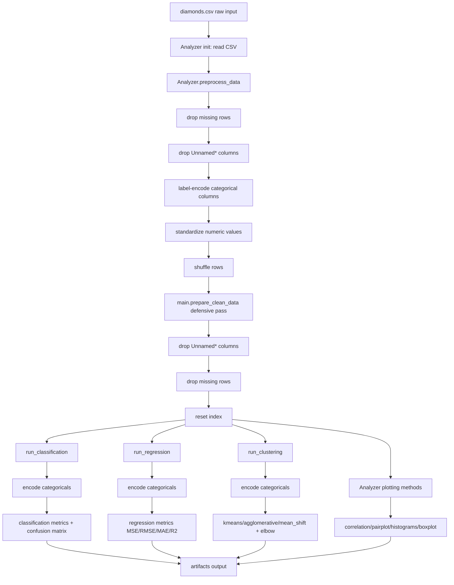

# Code Explanation Guide

This document explains the purpose of each major line block in the four core modules:
- Analyzer.py
- Classifier.py
- Regressor.py
- Clustering.py

Goal:
- Help you explain this project to teammates, reviewers, or instructors.
- Clarify not only what each line does, but why it exists.

How to read this guide:
1. Open the target file side-by-side with this guide.
2. Walk through section by section in order.
3. Use the Why notes when presenting to others.

---

## Analyzer.py walkthrough

### 1) Imports
- import os
  - Why: used to create output directories safely before saving figures.
- import pandas as pd
  - Why: main dataframe operations for CSV load, preprocessing, and transformation.
- import matplotlib.pyplot as plt
  - Why: plotting and saving visualizations.
- import seaborn as sns
  - Why: higher-level statistical visuals (heatmap, pairplot, boxplot styling).
- from sklearn.preprocessing import LabelEncoder, StandardScaler
  - Why: convert categorical text to numeric labels and scale numeric features for model-friendly ranges.

### 2) Class initialization
- class Analyzer:
  - Why: encapsulates all analysis/preprocessing behavior in one reusable object.
- def __init__(self, file_path):
- self.data = pd.read_csv(file_path)
  - Why: immediate dataset load at object creation so all later methods can work on self.data.

### 2.1) Shared unnamed-column cleaner
- _drop_unnamed_columns(df=None)
  - What: removes auto-generated CSV index columns like `Unnamed: 0`.
  - Why: prevents junk columns from affecting plots, scaling, and downstream model features.
  - Behavior:
    1. If `df` is passed, it returns a cleaned copy.
    2. If `df` is omitted, it cleans `self.data` in place.

### 3) Dataset read/inspect methods
- read_dataset(file_path)
  - What: reloads/replaces self.data from another CSV path.
  - Why: allows reusing same Analyzer instance for multiple files.
- describe()
  - What: returns dataframe statistics (including non-numeric columns).
  - Why: quick profiling step before modeling.
- show_info(), show_head()
  - What: prints schema and sample rows.
  - Why: debugging and sanity checks during EDA.

### 4) Structural cleaning methods
- drop_columns(columns)
  - What: drops columns only if they exist.
  - Why: avoids KeyError and supports robust pipelines when column presence varies.
- shuffle(random_state=42)
  - What: deterministic row shuffle.
  - Why: prevents ordering bias and improves reproducibility.
- Shuffle(random_state=42)
  - What: alias to shuffle.
  - Why: backward compatibility with earlier naming expectations.
- drop_missing_data()
  - What: remove rows with nulls, reset index.
  - Why: most sklearn estimators fail or become inconsistent with missing values unless handled explicitly.

### 5) Main preprocessing pipeline
- preprocess_data()
  - Pipeline steps in order:
    1. drop_missing_data()
    2. _drop_unnamed_columns()
    3. label-encode object/string columns
    4. standardize all columns
    5. shuffle()
  - Why this sequence:
    - Drop bad rows first.
    - Remove junk index column before transforms.
    - Encode categorical text before scaling.
    - Scale features to comparable magnitudes.
    - Shuffle after transforms for unbiased train/test splits later.
- print("Data preprocessing completed.")
  - Why: explicit progress feedback in script workflows.

Important note:
- Using one LabelEncoder instance repeatedly per column is fine because fit_transform is called fresh each loop iteration.

### 6) Save/output helper
- save_cleaned_data(output_path)
  - What: ensures unnamed columns are removed, then writes processed dataframe to CSV.
  - Why: persistent artifact for downstream modules and reproducible experiments.

### 7) Targeted encoding helpers
- encode_features(columns)
  - What: manual per-column label encoding.
  - Why: selective encoding when full preprocessing is not desired.
- encode_label(column)
  - What: encode one label/target column.
  - Why: classification targets often need integer classes.

### 8) Sampling utility
- sample(reduction_factor)
  - What: returns sampled subset by fraction.
  - Why: faster experimentation on large data.
- reduction_factor validation
  - Why: guardrail against invalid fractions.

### 9) Visualization methods

#### plot_correlation_matrix(save_path=None, show=True)
- First removes `Unnamed*` columns through `_drop_unnamed_columns(self.data)`.
- Creates encoded copy for non-numeric columns.
  - Why: correlation requires numeric input.
- Computes corr matrix and renders seaborn heatmap.
  - Why: reveals linear relationships and multicollinearity.
- save_path / show flags
  - Why: supports both notebook use and headless CI/script execution.

#### plot_correlationMatrix(...)
- Alias for naming compatibility.

#### plot_pairPlot(columns=None, ...)
- Removes `Unnamed*` columns first, then uses seaborn pairplot over selected/full columns.
  - Why: visual pairwise distribution + relationships + outlier clues.

#### plot_histograms_numerical(...)
- Removes `Unnamed*` columns first, then draws numeric histograms via pandas hist.
  - Why: quick feature distribution understanding.

#### Plot_histograms_numerical(...)
- Alias compatibility.

#### plot_histograms_categorical(...)
- Removes `Unnamed*` columns first, then creates bar charts from value_counts for each categorical column.
  - Why: class balance and category frequency insight.
- save_dir creation before save
  - Why: prevents path-not-found failures.

#### Plot_histograms_categorical(...)
- Alias compatibility.

#### plot_boxPlot(column, ...)
- Removes `Unnamed*` columns first, then draws boxplot for selected column.
  - Why: outlier and spread inspection.

#### Plot_boxPlot(...)
- Alias compatibility.

---

## Classifier.py walkthrough

### 1) Imports
- matplotlib + os
  - Why: confusion matrix plotting and artifact directory creation.
- train_test_split
  - Why: internal tuning/training helper methods split data when needed.
- metrics imports (accuracy, confusion_matrix, f1, precision, recall)
  - Why: multi-metric model evaluation.
- model imports (KNN, DecisionTree, RandomForest, SVC, LogisticRegression)
  - Why: supported classifier family.
- LabelEncoder
  - Why: ensure target labels are numeric for sklearn/Keras.

### 2) Constructor
- self.X = data.drop(columns=[target]), self.y = data[target]
  - Why: explicit feature/label separation.
- dtype guard + LabelEncoder on target
  - Why: converts non-integer targets to class IDs.
- self.models = {}
  - Why: registry of fitted models by name.
- self.supported_models set
  - Why: central source of allowed model keys.

### 3) _build_model(model_name, **params)
Factory method that returns an unfitted model configured by params.

- logistic_regression branch
  - Why: linear baseline classifier with configurable max_iter.
- knn branch
  - Why: distance-based non-parametric classifier.
- decision_tree branch
  - Why: interpretable non-linear learner.
- random_forest branch
  - Why: bagged tree ensemble for stronger performance.
- svc branch
  - Why: margin-based classifier with kernel support.
- ann branch
  - Imports TensorFlow Keras lazily.
    - Why: avoid hard import cost/failure if ANN not used.
  - Builds Sequential network with hidden layers and softmax output.
    - Why: multi-class classification.
  - loss = sparse_categorical_crossentropy
    - Why: targets are class indices, not one-hot vectors.
- final ValueError
  - Why: clear failure on unsupported model names.

### 4) fit(model_name, X_train, y_train, **params)
- Calls factory and trains model.
- ANN branch uses epochs/batch_size and silent verbose=0.
- Non-ANN branch calls sklearn fit directly.
- Stores fitted model in self.models[model_name].
  - Why: allows later predict/score by model name.

### 5) Hyperparameter tuner
- tune_knn(...)
  - Splits self.X/self.y once.
  - Tries each k and tracks accuracy.
  - Returns best_k, best_acc, scores dict.
  - Why: automate basic KNN search.

### 6) Convenience train_* wrappers
- train_knn, train_logistic_regression, train_decision_tree, train_random_forest, train_svc, train_ann
  - What: one-call training + print metrics.
  - Why: easier manual experimentation/demo.

Design caveat:
- These wrappers save model under title-cased keys (for example KNN) while main API uses lowercase keys.
- predict() handles both by checking lowercase and original key.

### 7) predict(model_name, X)
- Fetches model from registry.
- ANN prediction uses argmax(axis=1).
  - Why: softmax output gives class probabilities; argmax converts to class label.

### 8) score(model_name, X, y, metric='accuracy')
- Supports callable metric or named metric strings.
- Handles accuracy/f1_macro/precision_macro/recall_macro.
- zero_division=0 in precision/recall.
  - Why: avoids runtime warnings/crashes for missing predicted classes.

### 9) plot_confusion_matrix(...)
- Uses from_predictions for clean plot generation.
- Optional save_path directory creation.
- Optional show toggle.
- Returns raw confusion matrix array for programmatic use.

---

## Regressor.py walkthrough

### 1) Imports
- importlib
  - Why: dynamic tensorflow imports only when ANN path used.
- train_test_split, regression metrics, regression estimators, numpy
  - Why: model building, tuning, and metric computation.

### 2) Constructor
- Splits features/target and creates model registry.
- supported_models set mirrors classifier style.
  - Why: consistent API design across tasks.

### 3) _build_model(model_name, **params)
Regression model factory.

- linear_regression
  - Why: baseline linear fit.
- knn regressor
  - Why: local averaging method.
- decision tree regressor
  - Why: non-linear partitioning regressor.
- random forest regressor
  - Why: stronger generalization via ensembling.
- svr
  - Why: support vector regression with kernel/C control.
- ann
  - Dynamic tensorflow.keras imports via importlib.
  - Builds Sequential MLP:
    - input Dense layer
    - optional hidden layers with Dropout
    - final Dense(1) output for scalar regression
  - Compiles with mse loss and mae metric.
  - Why: standard neural regression configuration.
- unsupported model ValueError
  - Why: explicit guard.

### 4) fit(...)
- ANN fit supports validation_data, epochs, batch_size.
- Others use sklearn fit.
- Stores model in lowercase key.

### 5) Tuning methods
- tune_knn
  - Sweeps k values using R2 as objective.
- tune_decision_tree
  - Sweeps split criteria.
- tune_random_forest
  - Grid search over n_estimators and criterion.
  - Returns best params + score map.

Why R2 for tuning:
- Maximizing R2 is intuitive for regression quality comparisons across candidate models.

### 6) Convenience train_* methods
- train_knn, train_linear_regression, train_decision_tree, train_random_forest, train_svc, train_ann
  - Split internally and print R2 + MSE.
  - Why: quick demo/training commands.

Design caveats to explain when presenting:
1. train_svc stores model under key SVC even though model is SVR.
2. Docstring in train_random_forest mentions mse/mae terms, but sklearn now uses squared_error/absolute_error naming.

### 7) predict(model_name, X_new)
- Retrieves model by lowercase/original key.
- Returns flattened output when possible.
  - Why: normalize output shape across sklearn and keras predictions.

### 8) score(model_name, X_test, y_test)
- Computes and returns metrics dict:
  - MSE, RMSE, MAE, R2
- Why: multi-metric regression evaluation in one call.

---

## Clustering.py walkthrough

### 1) Imports
- AgglomerativeClustering, KMeans, MeanShift
  - Why: three unsupervised clustering algorithms required by project.
- silhouette_score
  - Why: cluster quality metric for k > 1.
- matplotlib
  - Why: elbow plot visualization.

### 2) Constructor
- self.data, self.models, self.inertias_
  - Why: store dataset, trained clusterers, and elbow history.

### 3) fit(model_name, X=None, **params)
- Defaults X to self.data.
  - Why: allows direct call without passing data each time.
- kmeans branch
  - trains and returns labels via fit_predict.
  - stores model under kmeans key.
- agglomerative branch
  - trains hierarchical clustering and returns labels.
- mean_shift branch
  - trains mean-shift and returns labels.
- unsupported ValueError
  - Why: explicit guardrail.

### 4) get_kmeans_inertia()
- Reads inertia from stored kmeans model.
- Throws clear error if kmeans not trained yet.
  - Why: prevents silent None access.

### 5) elbow_with_silhouette(max_k=10)
- Loops k=1..max_k:
  - collects inertia for each k
  - collects silhouette for k > 1 only
- Stores inertias in self.inertias_.
- Returns both curves in one dict.
  - Why: combined diagnostic for selecting cluster count.

### 6) elbow_curve(max_k=10, save_path=None, show=True)
- Recomputes inertia list and plots elbow chart.
- Supports save and headless close behavior.
- Returns inertias list for programmatic use.

### 7) Legacy helper methods
- kmeans_clustering(max_k=10)
  - prints silhouette scores and displays elbow.
- agglomerative_clustering(n_clusters=2)
- mean_shift_clustering()
  - wrappers around fit() plus user-facing prints.

### 8) predict(model_name, new_data)
- Fetches model from registry.
- Verifies model has predict method.
  - Why: not all clustering estimators support predicting new samples.
- Raises explicit ValueError for unsupported prediction.

---

## main.py clean-first policy walkthrough

### 1) Shared cleaning helper
- prepare_clean_data(df)
  - What: central cleaning function used across pipeline tasks.
  - Rules:
    1. Drop columns whose names start with `Unnamed` (case-insensitive).
    2. Drop rows with missing values.
    3. Reset index.
  - Why: guarantees consistent inputs for all ML tasks and plotting.

### 2) Where it is applied
- run_analyzer(...)
  - After `analyzer.preprocess_data()`, it applies `prepare_clean_data` again defensively before save/plots.
- run_classification(data)
- run_regression(data)
- run_clustering(data)
  - Each function begins with `cleaned = prepare_clean_data(data)` before encoding/modeling.

Why this matters:
1. Even if a raw dataframe is passed directly, every task still uses cleaned data.
2. Prevents `Unnamed: 0` and null values from leaking into metrics and charts.

---

## How to explain this to others (presentation script)

Use this 6-step explanation in meetings or viva:

1. Data understanding layer
- Analyzer handles loading, cleaning, encoding, scaling, and plotting.
- `main.py` enforces an additional shared clean-first gate so all model tasks receive consistent inputs.

2. Task-specific model layers
- Classifier predicts categorical outputs.
- Regressor predicts continuous outputs.
- Clustering groups unlabeled points.

3. Shared design pattern
- Each model module uses model-name keys and factory methods to keep API consistent.

4. Training strategy
- Simple baseline + tuned alternatives (for example KNN tuning) + optional ANN.

5. Evaluation strategy
- Classification: accuracy/f1/precision/recall + confusion matrix.
- Regression: MSE/RMSE/MAE/R2.
- Clustering: inertia and silhouette.

6. Artifact strategy
- Save plots and outputs so runs are reproducible and reviewable.

---

## Data flow diagram

Use this diagram to explain the clean-first architecture quickly:



Presentation note:
1. There are two cleaning gates by design: Analyzer preprocessing and the shared `prepare_clean_data` in `main.py`.
2. The second gate is defensive and guarantees consistency even if raw data is passed directly to task functions.

---

## One-slide summary (non-technical)

Use this if your audience is not technical:

```text
Input Data (CSV)
  ->
Automatic Cleaning
  - remove empty/missing rows
  - remove useless index columns (Unnamed*)
  ->
Feature Preparation
  - convert text categories to numeric form
  ->
Three Analysis Paths
  1) Classification (predict class labels)
  2) Regression (predict numeric values)
  3) Clustering (group similar records)
  ->
Visual Outputs + Metrics
  - correlation matrix, histograms, pairplot, boxplot
  - accuracy / error scores / cluster diagnostics
  ->
Saved Artifacts (reproducible results)
```

Speaker script (30-45 seconds):
1. We load raw diamonds data and clean it automatically.
2. We remove unusable columns and missing rows to keep quality high.
3. We prepare features in machine-readable form.
4. We run classification, regression, and clustering in parallel workflows.
5. We produce charts and metrics, then save everything as artifacts for reproducibility.

---

## Suggested improvements (optional talking points)

1. Replace LabelEncoder on feature columns with OneHotEncoder for nominal categories.
2. Avoid scaling target in Analyzer.preprocess_data if using regression directly from that output.
3. Unify model key casing across all convenience train_* methods.
4. Add type hints and logging for maintainability.
5. Add unit tests around tuner methods and plotting save paths.

---

Prepared for project explanation and handoff.
